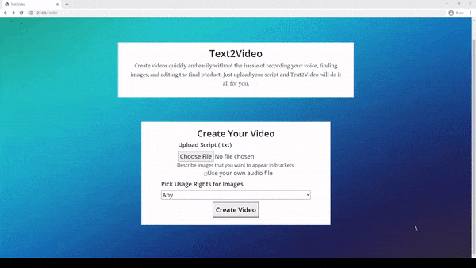

# Text2Video

Text2Video's purpose is to help people create videos quickly and easily by simply typing out the video’s script and a description of images to include in the video.



## Usage

Just upload a script and an optional audio file of you saying the script<br>
To start the server run this in the terminal

```
docker start gentle
python app.py
```

To stop the server open the same terminal and press CTRL-C. After that run

```
docker stop gentle
```
```

Must install [ffmpeg](https://www.ffmpeg.org/download.html#build-windows) and add it to PATH

## Requirements

Python 3.8 or up

